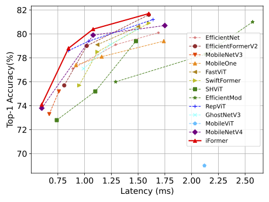
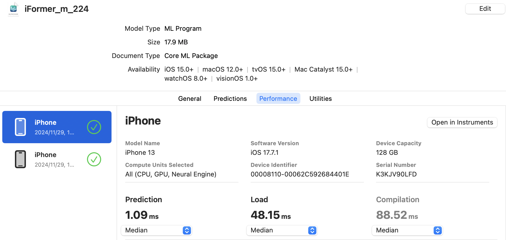

# [IFORMER: INTEGRATING CONVNET AND TRANS- FORMER FOR MOBILE APPLICATION](https://arxiv.org/abs/2501.15369)
Official PyTorch implementation of **iFormer**, published on [**ICLR 2025**](https://openreview.net/forum?id=4ytHislqDS).

<br/>
<details>
  <summary>
  <font size="+1">Abstract</font>
  </summary>
We present a new family of mobile hybrid vision networks, called iFormer,
with a focus on optimizing latency and accuracy on mobile applications. iFormer effectively integrates the fast local representation capacity of convolution with the efficient global modeling ability of self-attention. The local interactions are derived from transforming a standard convolutional network, \textit{i.e.}, ConvNeXt, to design a more lightweight mobile network. Our newly introduced mobile modulation attention removes memory-intensive operations in MHA and employs an efficient modulation mechanism to boost dynamic global representational capacity. We conduct comprehensive experiments demonstrating that iFormer outperforms existing lightweight networks across various tasks.
Notably, iFormer achieves an impressive Top-1 accuracy of 80.4\% on ImageNet-1k with a latency of only 1.10 ms on an iPhone 13,
surpassing the recently proposed MobileNetV4 under similar latency constraints. Additionally, our method shows significant improvements in downstream tasks, including COCO object detection, instance segmentation, and ADE20k semantic segmentation, while still maintaining low latency on mobile devices for high-resolution inputs in these scenarios. The source code and trained models will be available soon.
</details>

<br/>

<p align="center">
   <br>
  iFormer is Pareto-optimal compared to existing methods on ImageNet-1k. The latency is measured on an iPhone 13.
</p>

<br/>

## **What's New** 💥💥💥
- [2025/1/23] Our paper has been accepted to ICLR 2025.
- [2024/12/1] All models have been released.

## Main Results on ImageNet with Pretrained Models
| Model      | Params(M) | GMACs | Latency(ms) | Top-1(%)  |                                                                                             Ckpt.                                                                                              |                                                                                                          Core ML                                                                                                          |                                                                                               Log                                                                                               |
|:-----------|:---------:|:-----:|:-----------:|:---------:|:----------------------------------------------------------------------------------------------------------------------------------------------------------------------------------------------:|:-------------------------------------------------------------------------------------------------------------------------------------------------------------------------------------------------------------------------:|:-----------------------------------------------------------------------------------------------------------------------------------------------------------------------------------------------:|
| iFormer-T  |    2.9    | 0.53  |    0.60     |   74.1    |                                                     [300e](https://github.com/ChuanyangZheng/iFormer/releases/download/v0.9/iFormer_t.pth)                                                     |                                                           [300e](https://github.com/ChuanyangZheng/iFormer/releases/download/v0.9/iFormer_t_224.mlpackage.zip)                                                            |                                                     [300e](https://github.com/ChuanyangZheng/iFormer/releases/download/v0.9/iFormer_t.out)                                                      |
| iFormer-S  |    6.5    | 1.09  |    0.85     |   78.8    |                                                     [300e](https://github.[iFormer_s.out](..%2F..%2Flogs%2FiFormer_s.out)com/ChuanyangZheng/iFormer/releases/download/v0.9/iFormer_s.pth)                                                     |                                                           [300e](https://github.com/ChuanyangZheng/iFormer/releases/download/v0.9/iFormer_s_224.mlpackage.zip)                                                            |                                                     [300e](https://github.com/ChuanyangZheng/iFormer/releases/download/v0.9/iFormer_s.out)                                                      |
| iFormer-M  |    8.9    | 1.64  |    1.10     | 80.4/81.1 | [300e](https://github.com/ChuanyangZheng/iFormer/releases/download/v0.9/iFormer_m.pth)/[300e distill](https://github.com/ChuanyangZheng/iFormer/releases/download/v0.9/iFormer_m_distill.pth)  |     [300e](https://github.com/ChuanyangZheng/iFormer/releases/download/v0.9/iFormer_m_224.mlpackage.zip)/[300e distill](https://github.com/ChuanyangZheng/iFormer/releases/download/v0.9/iFormer_m_224_distill.mlpackage.zip)     | [300e](https://github.com/ChuanyangZheng/iFormer/releases/download/v0.9/iFormer_m.out) / [300e distill](https://github.com/ChuanyangZheng/iFormer/releases/download/v0.9/iFormer_m_distill.out) |
| iFormer-L  |   14.7    | 2.63  |    1.60     | 81.9/82.7 | [300e](https://github.com/ChuanyangZheng/iFormer/releases/download/v0.9/iFormer_l.pth) /[300e distill](https://github.com/ChuanyangZheng/iFormer/releases/download/v0.9/iFormer_l_distill.pth) | [300e](https://github.com/ChuanyangZheng/iFormer/releases/download/v0.9/iFormer_l_224.mlpackage.zip)/[300e distill](https://github.com/ChuanyangZheng/iFormer/releases/download/v0.9/iFormer_l_224_distill.mlpackage.zip) |                                            [300e](https://github.com/ChuanyangZheng/iFormer/releases/download/v0.9/iFormer_l.out) /[300e distill](https://github.com/ChuanyangZheng/iFormer/releases/download/v0.9/iFormer_l_distill.out)                                             |
| iFormer-L2 |   24.5    | 4.50  |    2.30     |   83.9    |                                            [300e distill](https://github.com/ChuanyangZheng/iFormer/releases/download/v0.9/iFormer_l2_distill.pth)                                             |                                                   [300e distill](https://github.com/ChuanyangZheng/iFormer/releases/download/v0.9/iFormer_l2_224_distill.mlpackage.zip)                                                   |                                             [300e distill](https://github.com/ChuanyangZheng/iFormer/releases/download/v0.9/iFormer_l2_distill.out)                                             |
| iFormer-H  |   99.0    | 15.5  |      -      |   84.8    |                                                     [300e](https://github.com/ChuanyangZheng/iFormer/releases/download/v0.9/iFormer_h.pth)                                                     |                                                           [300e](https://github.com/ChuanyangZheng/iFormer/releases/download/v0.9/iFormer_h_224.mlpackage.zip)                                                            |                                                     [300e](https://github.com/ChuanyangZheng/iFormer/releases/download/v0.9/iFormer_h.out)                                                      |
* iFormer-L2 is trained with distillation for 450 epochs.

## Getting Started
### Requirements
```bash
git clone git@github.com:ChuanyangZheng/iFormer.git
cd iFormer
pip install -r requirements.txt
```

### Data Preparation
We use a standard ImageNet dataset, you can download it from http://image-net.org/.
- The file structure should look like this:
  ```bash
  imagenet
  ├── train
  │   ├── class1
  │   │   ├── img1.jpeg
  │   │   └── ...
  │   ├── class2
  │   │   ├── img3.jpeg
  │   │   └── ...
  │   └── ...
  └── val
      ├── class1
      │   ├── img4.jpeg
      │   └── ...
      ├── class2
      │   ├── img6.jpeg
      │   └── ...
      └── ...
 
  ```
### Training
```bash
python -m torch.distributed.launch --nproc_per_node=8  \
    main.py \
    --cfg-path configs/iFormer_m.yaml
```
### Evaluation
```bash
python -m torch.distributed.launch --nproc_per_node=1  \
    main.py  \
    --model iFormer_m \
    --input_size 224 \
    --num_workers 16 \
    --layer_scale_init_value 0 \
    --finetune $ckpt_path \
    --eval true \
    --data_path $data_path
```
This should give
```bash
* Acc@1 80.420 Acc@5 95.336 loss 1.010
```
Distillation
```bash
python -m torch.distributed.launch --nproc_per_node=1  \
    main.py  \
    --model iFormer_m \
    --input_size 224 \
    --num_workers 16 \
    --layer_scale_init_value 0 \
    --distillation_type hard \
    --finetune $ckpt_path \
    --eval true \
    --data_path $data_path
```
This should give
```bash
* Acc@1 81.068 Acc@5 95.466 loss 0.746
```

Layer scale
```bash
python -m torch.distributed.launch --nproc_per_node=1  \
    main.py  \
    --model iFormer_h \
    --input_size 224 \
    --num_workers 16 \
    --layer_scale_init_value 1e-6 \
    --finetune $ckpt_path \
    --eval true \
    --data_path $data_path
```
This should give
```bash
* Acc@1 84.820 Acc@5 97.058 loss 0.843
```

* These configurations should be consistent with training configurations.

Get the FLOPs and parameters 
```bash
python flops.py
```
### Latency Measurement
Compile your model by Core ML Tools (CoreML)
```bash
python export_coreml.py --model=iFormer_m --resolution=224
```
For downstream tasks, we compile the backbone with a larger resolution of 512 x 512.
```bash
python export_coreml.py --model=iFormer_m --resolution=512
```

Benchmark the compiled model using Xcode (version 15.4) on an iPhone 13 (iOS 17.7), giving you the following latency.

* You can change the software version you want, but we have noticed that different iOS versions may affect latency measurements.
* Some specific latency variations across different devices and iOS versions can be found at [issues 4](https://github.com/ChuanyangZheng/iFormer/issues/4)
## Downstream Tasks

[Object Detection on COCO](detection/README.md)<br>
[Semantic Segmentation on ADE20K](segmentation/README.md)

## Acknowledgement

Image Classification code is partly built with [ConvNeXt](https://github.com/facebookresearch/ConvNeXt), [timm](https://github.com/huggingface/pytorch-image-models), and [RepViT](https://github.com/THU-MIG/RepViT).

Object detection & instance segmentation are trained on [MMDetection toolkit](https://github.com/open-mmlab/mmdetection).

Semantic segmentation is trained on [MMSegmentation toolkit](https://github.com/open-mmlab/mmsegmentation).

Sincerely appreciate their elegant implementations!
## Citation
If you find this repository helpful, please consider citing:
```
@article{zheng2025iformer,
  title={iFormer: Integrating ConvNet and Transformer for Mobile Application},
  author={Zheng, Chuanyang},
  journal={arXiv preprint arXiv:2501.15369},
  year={2025}
}
```